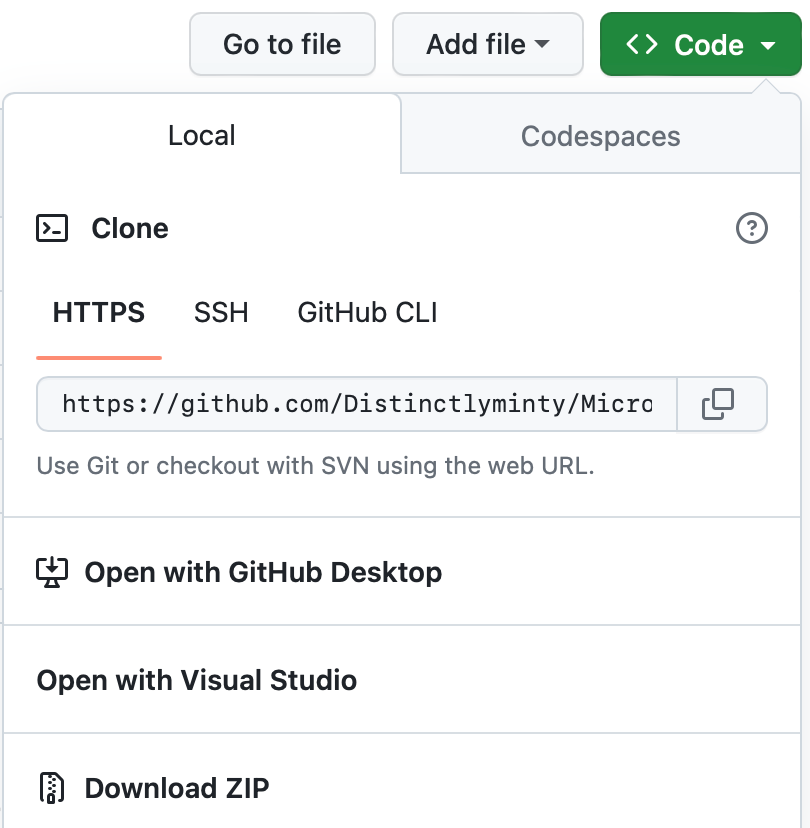

# Installation Instructions

This guide provides step-by-step instructions for installing Node.js, Node Version Manager (NVM), Visual Studio Code, and Git on macOS and Windows.

## Installation on macOS

### Node.js

1. Visit the [official Node.js website](https://nodejs.org/).

2. Download the macOS installer for the LTS (Long Term Support) version.

3. Run the installer and follow the on-screen instructions to install Node.js and npm (Node Package Manager).

### Node Version Manager (NVM) (Optional)

1. Open Terminal on your Mac.

2. Run the following command to install NVM:

   ```shell
   curl -o- https://raw.githubusercontent.com/nvm-sh/nvm/v0.39.1/install.sh | bash

Close and reopen your Terminal to use NVM. You can now use NVM to install and manage different Node.js versions.

### Visual Studio Code
1. Visit the official Visual Studio Code website.
2. Download the macOS version of Visual Studio Code.
3. Run the installer and follow the on-screen instructions to install Visual Studio Code.

### Git
1. Open Terminal on your Mac.
2. Run the following command to install Git using Homebrew:

    ```shell
    brew install git

## Installation on Windows

### Node.js
1. Visit the official Node.js website.
2. Download the Windows installer for the LTS (Long Term Support) version.
3. Run the installer and follow the on-screen instructions to install Node.js and npm.

### Visual Studio Code
1. Visit the official Visual Studio Code website.
2. Download the Windows version of Visual Studio Code.
3. Run the installer and follow the on-screen instructions to install Visual Studio Code.

#### Git
1. Visit the official Git website.
2. Download the Windows installer for Git.
3. Run the installer and follow the on-screen instructions. Make sure to select the option to add Git to your system's PATH during installation.

Note: Node Version Manager (NVM) is not commonly used on Windows but can be used on Windows Subsystem for Linux (WSL) if needed.

## Cloning the Course Source Code
The source code for this course is avaiable inb the course assets on the Pluralsight website.  It's also available on Github.  

https://github.com/Distinctlyminty/MicroserviceFundamentals

1. Visit the [Microservice Fundamentals page on GitHub](https://github.com/Distinctlyminty/MicroserviceFundamentals)
2. Clone the repository by clicking 'Code' and then selecting 'Open with Visual Studio'


Alternatively you can clone the repository at the command line.
1. Open the terminal and navigate to a folder where you would like to store the code.

    ```shell
    cd /path/to/your/desired/directory
    
2. Run the following command to clone the repository:

    ```shell
    git clone https://github.com/Distinctlyminty/MicroserviceFundamentals.git

